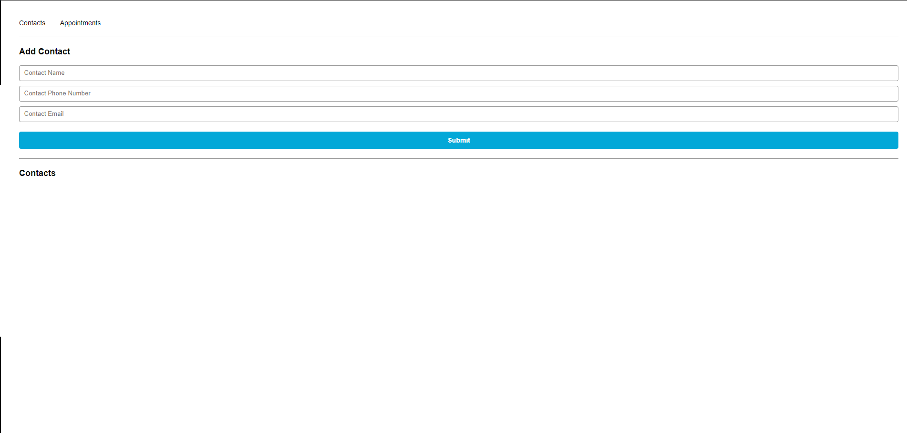

# React Appointment Planner
> The focus of this project was to showcase what I have learned in React including react-router and function component state to create a front end appointment planner. I built this as part of the Full Stack Engineer Career Path on [Codecademy](https://www.codecademy.com/learn). Please share any feedback regarding this project! Happy coding!

## Table of Contents
* [General Info](#general-information)
* [Technologies Used](#technologies-used)
* [Features](#features)
* [Screenshots](#screenshots)
* [Setup](#setup)
* [Usage](#usage)
* [Project Status](#project-status)
* [Room for Improvement](#room-for-improvement)
* [Acknowledgements](#acknowledgements)
* [Contact](#contact)
<!-- * [License](#license) -->

## General Information
- Portfolio to illustrate what I have learned and what I am learning
- Project created as part of the Full Stack Engineer Career Path on [Codecademy](https://www.codecademy.com/learn)
- Created using the CSS Flexbox model

## Technologies Used
     

## Features
- React Component Functions
- Create React App
- { useEffect, useState }
- React Router DOM

## Screenshots

<!-- If you have screenshots you'd like to share, include them here. -->

## Setup
- Live-version of the project can be found @ https://chris-appointment-planner.netlify.app/
- Project is available on [GitHub](https://github.com/ChrisDeCleene/appointment_planner)

## Project Status
Project is: _complete_

## Room for Improvement
Room for Improvement:
- All recommendations and feedback are welcome! Although I am no longer working on the front-end, that does not mean it is perfect or I am completely moving on.

To Do List:
- Create back-end to store appointments and contacts
- Account logins to save your information

## Acknowledgements
- This project was made with [Codecademy](https://www.codecademy.com/) as part of the Full Stack Engineering Career Path

## Contact
Created by [Chris DeCleene](https://chrisdecleene.github.io/) - feel free to contact me!

<!-- Optional -->
<!-- ## License -->
<!-- This project is open source and available under the [... License](). -->